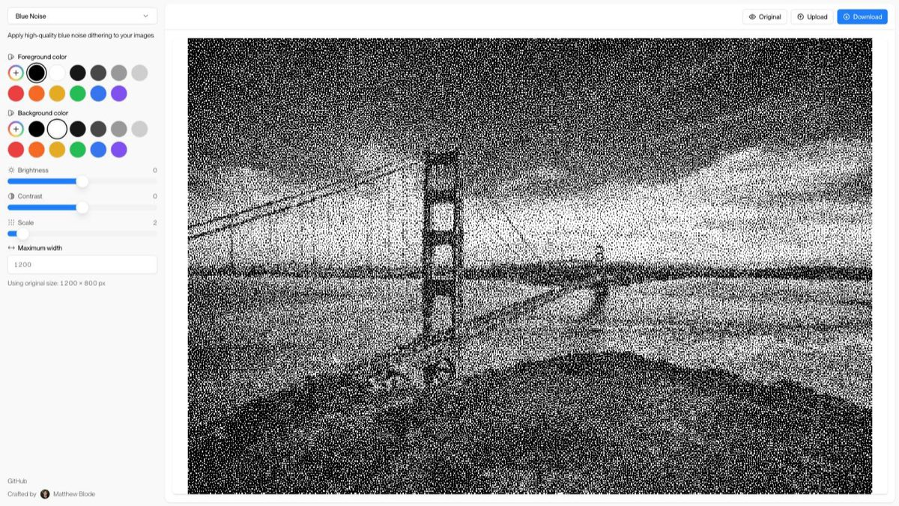

# [FX](https://blode.co/fx)

**Turn images and video into blue noise dithering, ASCII art, or an LED dot matrix, right in your browser**

Drop in a photo or a clip, pick a mode, and tune the look in real time.

  

## Demo

Drop in a file and try all three modes, free and with no sign-up.

## Modes

- **Blue Noise:** grainless dithering with your choice of foreground and background color. Adjust brightness, contrast, and scale.
- **ASCII:** glyph-based art rendered from a 95-character set, sampled per cell for real edge definition.
- **LED:** a red-to-white dot matrix where each cell's bar width and color encode brightness.

## What you can do

- **Drop in an image or video:** PNG, JPG, WebP, MP4, and more.
- **See it instantly:** the render updates live as you adjust settings.
- **Scrub through video:** play, pause, and seek with the effect on every frame.
- **Compare:** press and hold to peek at the original.
- **Export:** PNG for stills, or H.264 MP4 with the original audio kept.

## Private by design

Everything runs in your browser. Nothing is uploaded, stored, or sent anywhere.

## License

MIT

---

Crafted by  [Matthew Blode](https://blode.co)
